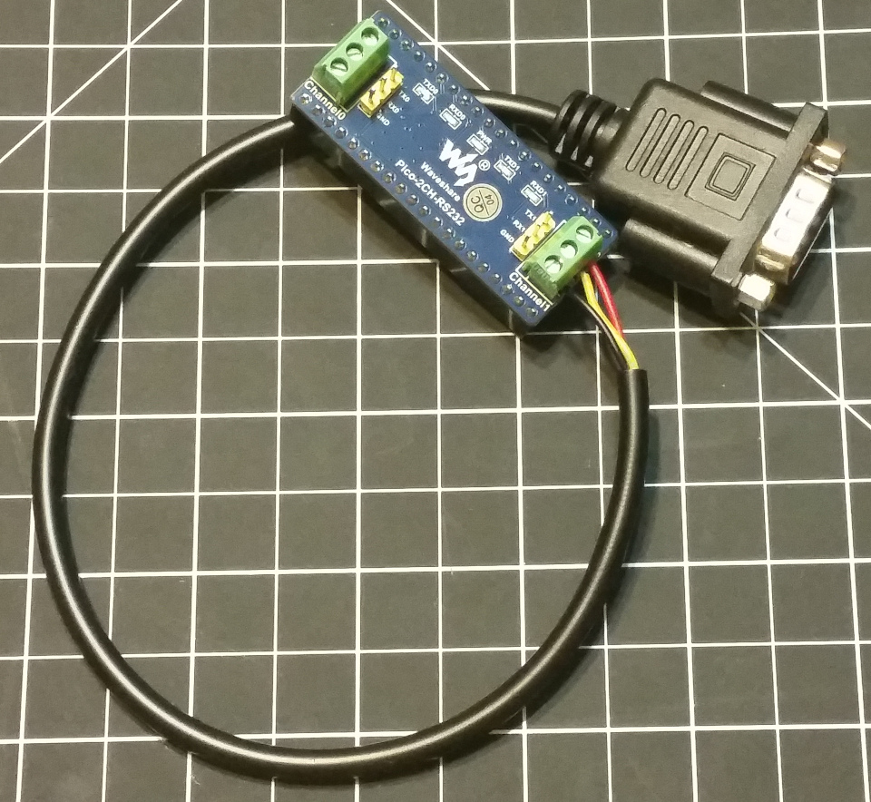
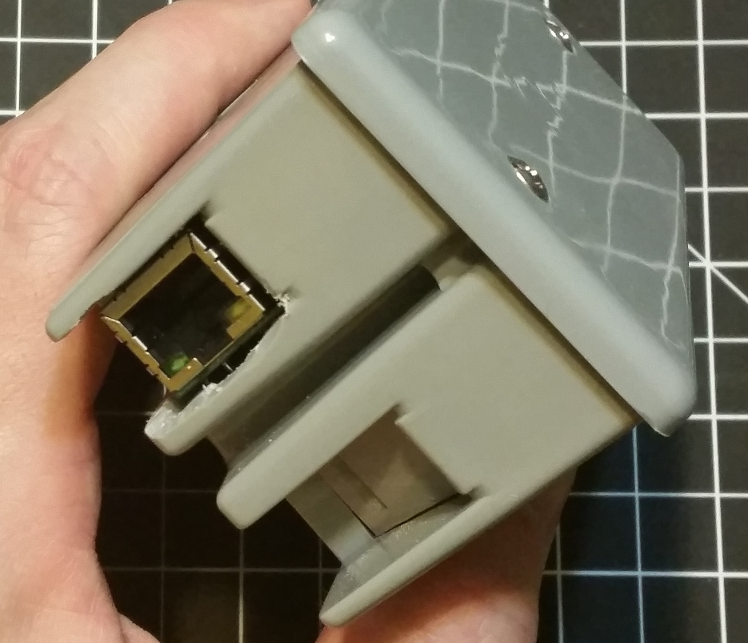

# pi-pico-serial-web-api

Web interface & API for an RS-232 controlled device (a Sharp AQUOS TV).

Update: This project won the [third place prize in WIZnet's Ethernet HAT Contest 2022](
https://maker.wiznet.io/wiznet-ethernet-hat-contest-winners/).

## Abstract

A Raspberry Pi Pico with hardwired Ethernet seems like the perfect platform to add web APIs to serial
controlled devices. I have a TV which has an RS-232 control interface for power on, changing inputs,
etc. A low-power Ethernet-serial bridge device would be ideal to make that interface more usable.

Hackaday [made a post](https://hackaday.com/2022/01/23/hackaday-links-january-23-2022/) that mentioned
WIZnet was [running a contest](https://maker.wiznet.io/wiznet-ethernet-hat-contest/) to demonstrate
products that add hardwired Ethernet to Raspberry Pi Pico boards. The WIZnet `W5100S-EVB-Pico`
is a Raspberry Pi Pico clone with hardwired Ethernet built right into the board. After learning that this
product existed, I realized this was an excellent fit for making a web API for the serial interface
on my TV. [This repository](https://github.com/chabala/pi-pico-serial-web-api)
represents [my entry into the WIZnet Ethernet HAT Contest](
https://maker.wiznet.io/2022/01/25/web-interface-api-for-rs232-controlled-device/).

If you are interested in running the project, you can copy the contents of [CIRCUITPY](CIRCUITPY) on
to your `W5100S-EVB-Pico` running CircuitPython and stop reading and start hacking.

## Why?

My TV already has a remote, what's the point? Mostly for better integration with home automation
solutions. Something seemingly as simple as asking your voice assistant to turn on the TV is still
frustratingly complex with off the shelf solutions. Having tried a Logitech Harmony product and
being disappointed with the functionality, the only real solution is to integrate with the TV's
native control interface. There are IR blasters, which is the basis for the Harmony, but my
Sharp AQUOS LC-52LE700UN has an RS-232 interface as well. Integrating with that directly frees me
from the constraints and limitations of a third party product. I can tailor the API to fit whatever
the home automation software needs and expose all the features the TV's API supports. This project
has been on my mind for some time, ever since reading about the interface in the manual. I've even
(cryptically) tweeted about it:

<blockquote class="twitter-tweet" data-theme="light">
<p lang="en" dir="ltr">Challenge accepted <br>
</p>
&mdash; Greg Chabala (@chabala) <a href="https://twitter.com/chabala/status/994328488529354752">May 9, 2018</a>
</blockquote>

But that was four years ago, what's the hangup? Well, having a serial interface is the easy part,
but for it to be useful, something needs to talk to it. I didn't want to station a PC next to my TV.
Even a small single board computer like a Raspberry Pi would effectively need to run 24/7 just
to be available to push commands to the TV, which is a waste of power. The existence of the WIZnet
`W5100S-EVB-Pico` changes that, being a microcontroller means it uses much less power
than a full computer, and the integrated Ethernet reduces the additional components needed. It is
just enough for this kind of project, and no more.

## Survey of prior art

Step zero in any project should be a search to see if anyone else has already done the work. I
searched GitHub for other projects that were trying to interface with Sharp TVs and found these:
 * https://github.com/partouf/AquosComm [Pascal, 2009]
 * https://github.com/bwkeller/pyaquos [Python, 2012]
 * https://github.com/p4ddy1/aquoscontrol [Go, 2017]
 * https://github.com/neerlent/aquostv_serial [Python, 2019]

These all target running software on a full computer rather than a microcontroller, but at least
some were also trying to integrate with home automation software. It's always good to see what's
out there before duplicating effort.

## Initial plan

Before entering the contest and requesting sample hardware I formed my plan. The WIZnet
`W5100S-EVB-Pico` has an Ethernet port, I would want to expose a REST API. I also needed
a serial connection. The Raspberry Pi Pico has a USB port, and some research showed it was capable
of [operating in host mode](https://forums.raspberrypi.com/viewtopic.php?t=305467), so in theory I
could connect a common USB-to-serial adapter to it.

### Selecting a software platform

Possible software toolkits available for the Pi Pico and clones:
 * C/C++ and/or assembly - https://github.com/raspberrypi/pico-sdk
 * MicroPython - https://github.com/micropython/micropython
 * CircuitPython - https://github.com/adafruit/circuitpython

My C++ is very rusty, so one of the Python variants seemed like a good place to start. CircuitPython is a
fork of MicroPython with an emphasis on ease of use for beginners, and is backed by Adafruit to ensure
good library support for their sensor products, so I chose to start with it.

Additionally, as I knew I was going to need some kind of web server for the REST API, in CircuitPython
this is provided by a [WSGI](https://en.wikipedia.org/wiki/Web_Server_Gateway_Interface) server module.

I drew up this diagram and requested the hardware:


## Early successes and hurdles


*The tiny WIZnet `W5100S-EVB-Pico`, with a touch of electrical tape to mask the power LED*

I set up the hardware following the guide at [Ethernet Example Getting Started \[CircuitPython\].md](
https://github.com/Wiznet/RP2040-HAT-CircuitPython/blob/master/Ethernet%20Example%20Getting%20Started%20%5BCircuitpython%5D.md)
which leans heavily on Adafruit's [Installing CircuitPython](
https://learn.adafruit.com/getting-started-with-raspberry-pi-pico-circuitpython/circuitpython)
guide. I follow the LED blink tutorial, LED blinks. Then I set up the Ethernet library, which again
delegates to an Adafruit tutorial, [Ethernet for CircuitPython with Wiznet5K](
https://learn.adafruit.com/ethernet-for-circuitpython/circuitpython-setup). Here I get my first taste
of confusion, as the sample code doesn't work.
```
code.py output:
Wiznet5k WebClient Test
Traceback (most recent call last):
File "code.py", line 17, in <module>
AttributeError: 'module' object has no attribute 'D10'
Code done running.
```
This looks like there's an error with `board.D10` not being defined. First interaction with the REPL:
```
>>> import board
>>> dir(board)
['__class__', '__name__', 'A0', 'A1', 'A2', 'A3', 'GP0', 'GP1', 'GP10', 'GP11', 'GP12', 'GP13', 
'GP14', 'GP15', 'GP16', 'GP17', 'GP18', 'GP19', 'GP2', 'GP20', 'GP21', 'GP22', 'GP23', 'GP24', 
'GP25', ]
```
Definitely not defined. I look to see if I missed installing `board`, and learn `board` is built into
CircuitPython.

Googled the error, but the results are people using CircuitPython on Raspberry Pi (not Pi Pico)
being advised to install `adafruit_blinka`, which is an abstraction layer that I should not need.

I started poking around in the issues on https://github.com/adafruit/Adafruit_CircuitPython_Wiznet5k
and found https://github.com/adafruit/Adafruit_CircuitPython_Wiznet5k/pull/49 which links to
https://gist.github.com/anecdata/3c6f37c05a91f7b769dad7517bfe3aa1 which is example code that works
fine.

Looking back at the WIZnet Getting Started guide, it seems they may have intended
https://github.com/Wiznet/RP2040-HAT-CircuitPython/blob/master/examples/Network/W5x00_Ping_Test.py
as initial example code. It's very similar to the working gist. Of interest though, they
both use different pins for the reset pin. The WIZnet example is correctly using `GP20`, but using
that pin in the gist's code causes it to fail to initialize. This turns out to be a bug in the
driver library, and I opened https://github.com/adafruit/Adafruit_CircuitPython_Wiznet5k/issues/51
to fix it.

Tested web server example code from
https://github.com/Wiznet/RP2040-HAT-CircuitPython/blob/master/examples/HTTP/Webserver/W5x00_WebServer.py
which works and shows the basics of URL routing.

At this point I've gotten network functionality working, and I want to test the serial end of things.
Based on some conversation on the [Adafruit Discord](http://adafru.it/discord), while the Pi Pico
hardware supports USB host mode, CircuitPython itself does not yet. There is work underway in the
USB stack (TinyUSB), and preliminary work on the CircuitPython API for it:
https://github.com/tannewt/circuitpython/tree/usb_host but nothing ready for use.

My option for using the USB serial adapter in the near term may only be to implement the USB host
logic myself in C, which is more than I bargained for. As a result, I ordered a [Waveshare
Pico-2CH-RS232](https://www.waveshare.com/pico-2ch-rs232.htm) pico-uart-to-serial adapter board.


*What could have been, if USB host mode was supported in CircuitPython*

## Fallback plan

Time to revise my diagram now that using USB host is shelved:


There's no real downside here, except that I had to buy a pico specific serial adapter board instead
of using a generic USB-serial adapter that I had on hand. The purpose of the board is to shift
voltage levels, from the TTL levels of the pico's UARTs, to the higher ~5V levels expected by
RS-232 devices. Also, this required soldering the header pins onto the pico, which would have
been unneeded otherwise.




## Getting a working MVP

After some poking around and experimenting with WSGI, I rewrote the two `/led_on` and
`/led_off` endpoints from the sample code into one `/led` endpoint in a more [HATEOAS](
https://en.wikipedia.org/wiki/HATEOAS) style, and learned how to handle GET and POST parameters
with it. It should be easier to follow that pattern and start flushing out the serial TV control
endpoint now without making a mess of it.

https://github.com/chabala/pi-pico-serial-web-api/blob/e81f4f882127e0290d8b4310b3c9e9d4933914b9/CIRCUITPY/code.py#L69-L93


The serial protocol used by the television is described in a [single page of the user manual](
documentation/sharp-LC52LE700UN-rs-232.pdf). The commands and responses are all basic ASCII. But
besides laying out the basics, there's not much technical detail, so some experimentation will be
needed. In fact, it barely mentions that some commands will accept question marks to allow you to
query what the current setting of the TV are, and there are no examples of those types of responses.

To start, I made a basic serial endpoint, that would allow me to construct links to send specific
command codes to the serial port. All commands are eight characters, which is nice and uniform.
The only wrinkle is that their protocol specifies two characters that are very annoying for URLs,
spaces and question marks. I elect to munge hyphens for spaces and `Q` for `?`, luckily neither
`Q` nor `-` are used in any of the commands, so it's easy to unmunge them in code prior to sending.

Now I can send a GET request to `/serial/POWR0---/` to turn off the TV. `/serial/RSPW1---/` enables
sending power on commands (which is disabled by default), and then `/serial/POWR1---/` will
turn the TV on. `/serial/POWRQ---/` will return `0` when the TV is off, and `1` when it is on.
More experimentation leads to more working commands, and I add them to my list of links.


### An aside about the WSGI server

One thing that became clear while playing with this is that the webserver is very flakey. It
works about 50% of the time, if I'm being generous. The rest of the time I receive garbled HTML
in the response. I have spent a lot of time looking at this, and can say the cause is somewhere
between the end of my function handing off to the WSGI server, and a hardware issue, but I'm more
likely to blame the software. I know this, because I added `print()` statements duplicating my
response HTML just before returning from my handler functions, and they are always 100% correct
in the REPL, even when the response is garbled.

Just how garbled the responses are is also impressive. Sometimes the page is simply truncated.
But sometimes it sends half the page, and then starts sending the first half a second time.
Sometimes it's so garbled the HTTP headers are incomplete and the browser rejects it. 
The good part is that my requests are being received fine, I'm just often blind to the resulting
page. I may have to refresh the page a few times to get a clear result.

I've tried making a minimal server, with a single endpoint that returns the same static string
every time, and I will still get garbled results, intermittently, but probably at least 20% of
the time. It's a little like an ATM that has a 50% chance of shredding your cash, but always
makes sure to deduct your account. I would expect to see issues on the WSGI library about it,
but there are none. I can't fathom how no one else has noticed this, unless no one else is
using the WSGI server. It's frustrating, but I'm not motivated to continue trying to debug the
library code. I'm just going to have to design around the faults.

One thing I noticed while working on the serial page is that as it got longer from adding more
links to it, the more frequently it failed to render, until it practically failed 95% of the
time. So it would seem that the issue is aggravated by longer responses.

### Back to the MVP

I have a web interface at `/serial/` with clickable links for operations on the TV, and they
send serial commands, as well as return response codes. That is enough to call a minimum
viable product, but my goal is a more HATEOAS style REST API. People have differing opinions
about what REST means, and I'm not going to fit my ideal interface onto a microcontroller,
but at a minimum I wanted it to:
 1. Be discoverable from the root URL
 2. Model some of the operations into related groups

Other RESTful ideas like using different HTTP verbs or modelling the state in available actions
are not very important here. While I experimented with POST requests on the `/led/` page,
GET requests are sufficient. Also, breaking up the API into the URL structure means that
individual pages can be smaller and avoid aggravating the WSGI server issues.

To that end, I made a `/tv/` endpoint, that breaks into four functional areas: power, volume,
input, and channel. Here's a tour of the UI.

* The root URL:


The `/led/` and `/serial/` endpoints were already shown above.

* The `/tv/` endpoint:


* The `/tv/power/` endpoint:


Interacting with any of the commands will return to the same page, but the response from the
command will be at the top of the page. There's also always a link to return to the prior
level of the API structure.

* The `/tv/volume/` endpoint:


* The `/tv/input/` endpoint:


One of the nice features of the Sharp AQUOS is that it has 8 inputs with some variety, not just
a couple of HDMI.

* The `/tv/channel/` endpoint:


Just a couple preset links here, but the API would allow building a URL for switching to any
channel directly.

That's all there is to it. The API doesn't need to be any smarter than that, I'm sure something
like HomeAssistant could interact with it easily. Perhaps there would be use for a 'bare response'
mode, that would return the response code as plain text and not return the HTML page at all, but
I leave that enhancement for the future.

## Enclosure

What to do about an enclosure? There are some options:

1. Do nothing. This seems like a bad idea, lots of exposed contacts that could potentially short.
2. Do almost nothing. I could wrap all or most of the pi pico in electrical tape, eliminating any
potential shorts, while ensuring it will be a sticky mess if I ever need to modify it again.
3. Buy a purpose built Pi Pico case. The Raspberry Pi Foundation has made official cases for pretty
much all of their single board computers, and there are plenty of aftermarket cases as well. Somewhat
strange then that there are almost no Pi Pico cases on the market. Of the few I found, only one
would have fit on the slightly larger form factor of the `W5100S-EVB-Pico`, not to mention the RS-232
board, and it was basically just [a piece of acrylic](https://amazon.com/dp/B09DK4XBGB/) that covered
the main area of the circuit board, and made no attempt to cover the pins. Useless.
4. Design and 3D print my own case. I have a feeling this is what I'm intended to do, but luckily I
don't have that hobby.
5. Buy a project box. I spent some time searching for 'project boxes', and found a lot of things in
the $10-15 range that were marketed as waterproof junction boxes. That seems okay, except that
waterproof is probably an anti-feature. I'm going to cut holes in it anyway to let cables enter and
any extra waterproofness just means less ventilation for the Pi and more chance for it to overheat.

In the end, I went to the hardware store, where I found a PVC handy box and cover for just under $3,
total. A little Dremel work to improve the fit and I was all set.





## Project cost

A quick summary of the expenses:
 * `W5100S-EVB-Pico` is MSRP $10, though WIZnet gave me this one for joining the contest
 * Waveshare Pico-2CH-RS232 was $13
 * PVC handy box & lid was $3
 * DE9 null modem serial adapter $4
 * MicroUSB power supply $5

$35 total to create this tiny single function device to allow controlling the TV via Ethernet.

## Notes for other developers

If you wish to update the libraries used here, I've included a [requirements.txt](requirements.txt)
and suggest the steps below to get started:
```shell
python3 -m venv .env
. .env/bin/activate
pip install -r requirements.txt
circup --path CIRCUITPY install -r requirements.txt
circup --path CIRCUITPY uninstall adafruit_bus_device
```
`circup` will install `adafruit_bus_device` because it is a dependency of `adafruit_wiznet5k`, however
`adafruit_bus_device` is baked into CircuitPython for the pi pico, so including it is not needed and
discouraged, hence the `uninstall` command above.

## Further enhancements

I'm planting my flag here for now, but there's more that could be done. When CircuitPython supports
USB host mode for CDC devices, like serial adapters, I'd be interested in trying it to see if I can
get closer to my original vision.

Also, there remain issues with the pages served from the device. Often, they come back garbled. In
the near term, I can refresh the request until I get an uncorrupted response, but that's not ideal.
I doubt it's a hardware issue, more likely it's in the WSGI library, or the socket library, or
CircuitPython itself.

That leads to my other big enhancement idea, ditching CircuitPython. It may have been convenient to
prototype with, but it feels rough, more like a toy language than a finished product. Things are
hacked together until they 'work', but not necessarily tested in any rigorous way. I get to find
the gaps, and supply the fixes. It may be that writing C/C++ is the only way to get a more resilient
final product out of it.

## License

All project code is MIT licensed. Adafruit library code is present as a convenience, but it retains
its own license(s), refer to the library repositories for more detail:
 * https://github.com/adafruit/Adafruit_CircuitPython_Requests
 * https://github.com/adafruit/Adafruit_CircuitPython_WSGI
 * https://github.com/adafruit/Adafruit_CircuitPython_Wiznet5k

This repository contains a reproduction of a single page of a manual, presumed to be under copyright
by SHARP ELECTRONICS CORPORATION. I assert fair use for including it.

My diagrams use images of the products represented, those assets are presumably under copyright of
their respective owners, but I again assert fair use for including them.
